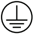

.. _电气连接:

电气连接
*********

.. _接地与屏蔽连接:

接地与屏蔽连接
+++++++++++++++

接地要求
==========

控制器柜接地必须来自电力网供电 PE。

  - 接地电缆的颜色应为绿黄色。
  - 控制器柜、机械手和外围设备的接地必须相同，最好是一个等电位接地网（网格）。
  - 接地连接点必须具有稳定的金属间结合，如螺丝固定。必须清除接触表面的油漆、灰尘、铁锈和其他绝缘材料。

关于控制柜内部电源接地连接的标志要求，请参见UL508C。关于应当如何设计接地系统的更多详情，请参见IEC 61000-5-2。关于 PE的横截面积详情，请参见 IEC60204-1。

接地装置
==========

接地位置和接地方式如下：

.. figure:: ./images/接地位置.*
    :align: center
    :width: 18cm

    接地位置

1. 将接地电缆连接并固定到机器人壳体的接地连接处 (1)。接地连接处标有 |接地| 符号。

2. 按以下顺序安装接地电缆：

   - 螺钉 M3 (2)
   - 锁紧垫圈 M3 (3)
   - 垫圈 M3 (4)
   - 环形电缆接线片 M3 (5)
   - 垫圈 M3 (6)

  拧紧扭矩：1.4Nm (12.4bf·in)，螺钉性能等级：8.8 或更高。

  接地电缆截面积为2.5mm² (AWG 13.2) 或更高。

3. 检查并确认电缆布线正确并紧固良好，以防止电缆和运动部件发生碰撞。

.. warning::

    **接地不当将导致触电危险**

    根据当地、地区和/或国家标准和法规，将机器人组件通过单一中心点接地。

    **不遵守这些说明可导致死亡或重伤。** 

.. _电源连接:

电源连接
+++++++++++

.. figure:: ./images/电源接口位置.*
    :align: center
    :width: 12cm
    
    电源接口位置

操作前提
===========

在将输入电源接入控制柜之前，必须满足以下条件：

- 必须安装外部断路器或保险丝。 
- 控制柜必须连接到保护接地。 
- 必须安装剩余电流设备（RCD）。 

连接电源
===========

|product_name| 电源接口包括机器人逻辑供电输入 VL+、功率供电输入 VP+ 和公共负极 GND 三个输入接口。逻辑电（VL+）为控制柜内部逻辑电源供电，功率电（VP+）为机器人本体供电，同时VP+也可为控制柜内部逻辑电源供电。接口定义如下表：

.. list-table:: 电源接口定义
   :widths: 40 60
   :header-rows: 1

   * - **信号**
     - **说明**

   * - VL+
     - 逻辑电供电输入

   * - VP+
     - 机器人供电输入

   * - GND
     - 0V输入

连接电源时，请选用符合下表的线束。

.. list-table:: 电源接口线束规格
   :widths: auto
   :header-rows: 1

   * - **端子型号**
     - **推荐压接端子**
     - **线缆面积**
     - **剥线长度**
   * - DEGSON：2EDGKM-7.62-03P-14
     - 国内：E2508
       
       海外：PHOENIX AI2,5-8GY-冷压头
     - 2mm² & 14AWG 
     - 7~8mm（0.28~0.31in）

机器人供电输入（VP+）为机器人本体供电，也可以为控制柜内部逻辑部分电路供电，当逻辑供电与机器人供电不需要分离时，只需接VP+和GND。如果需要紧急情况下将VP+断开，同时不希望控制柜逻辑回路断电，可以在VL+处单独接入逻辑电源。接线示意图如下图。 

.. figure:: ./images/电源接线.*
    :align: center
    :width: 12cm
    
    电源接线

推荐的电源型号如下：

.. list-table:: P1电源规格
   :widths: 50 50
   :header-rows: 1

   * - 
     - **Mini2C**
   * - 额定电压
     - 48 VDC
   * - 电压范围 \ :sup:`1`
     - 40~56 VDC
   * - 电流范围
     - 0~7 A
   * - 峰值功率
     - 672W
   * - 推荐型号  \ :sup:`2`
     - HRP-300N3-48，MW

.. list-table:: P2电源规格
   :widths: 50 50
   :header-rows: 1

   * - 
     - **Mini2C**
   * - 额定电压
     - 48 VDC
   * - 电压范围 \ :sup:`1`
     - 40~56 VDC
   * - 典型功率
     - 12W
   * - 最大功率
     - ≤30W

.. container:: table-notes

   | :sup:`1` Mini2C 不包含 30 V，机器人本体 30 V 为欠压阈值。
   | :sup:`2` 此处仅为推荐电源型号，客户可选购同等规格电源；峰值功率与机器人负载和使用场景有关。

.. _隔离电源连接:

隔离电源连接
==============

当 |product_name| 集成在复合机器人应用内时，须给 |product_name| 单独连接隔离48V电源模块。连接方式如下图。

.. figure:: ./images/隔离电源连接.*
    :align: center
    :width: 13cm
    
    隔离电源连接

推荐的隔离电源型号为 LRS-350N2-48。

.. _制动电压设置:

制动电压设置
==============

|product_name| 内部集成了电压制动电路，用于泄放机器人在减速以及刹车时产生的电动势。当使用外部动力电源时，需要在 Coboπ 软件上设置制动电压数值，以避免出现过压保护掉电或者控制柜损坏，具体操作见软件用户手册。

.. note::
  
  设置制动电压前需要使机器人处于下电下使能状态。

.. _机器人连接:

机器人连接
+++++++++++

COBOT接口用于连接机器人本体，此接口具有防呆带锁扣设计，JAKA提供适配线缆，将此线缆插入COBOT接口即可连接。

.. figure:: ./images/机器人接口位置.*
    :align: center
    :width: 12cm
    
    机器人接口位置

.. _网络连接:

网络连接
+++++++++++

.. figure:: ./images/网口位置.*
    :align: center
    :width: 12cm
    
    网口位置

|product_name| 有两个网口，位于背面板。

   - LAN1：千兆网口，固定IP，默认IP为10.5.5.100，不可修改。
   - LAN2：千兆网口，动态IP，提供DHCP服务。

.. attention::
  
  LAN2网口IP网段不能为10.5.5.x网段，如果配置为此网段，则会提示“此网段被禁用”。

.. _USB连接:

USB连接
+++++++++++

|product_name| 有两个USB 3.0接口，位于背面板。仅供内部调试使用。

.. figure:: ./images/USB接口位置.*
    :align: center
    :width: 12cm
    
    USB接口位置

.. _手柄连接:

手柄连接
+++++++++++

STICK接口用于连接JAKA手柄，将手柄连接线插入此接口即可连接手柄。此接口仅用于连接JAKA 控制柜手柄，不可任意改造。

.. figure:: ./images/手柄接口.*
    :align: center
    :width: 12cm
    
    手柄接口位置

.. attention::
  
  |product_name| 默认不提供手柄，如需使用手柄，需额外选配。

.. _急停设备连接:

急停设备连接
++++++++++++++

|product_name| 提供一个急停接口，可实现紧急停止功能。此接口为双路冗余设计，任何一个信号有效时，都可启用该功能。如需使用外部安全设备请选择支持双通道设计的设备。可根据实际安全要求，接入安全门、安全光幕、传感器等。

.. figure:: ./images/急停接口.*
    :align: center
    :width: 5cm
    
    急停接口

接口引脚说明如下：

#. 内部逻辑电24V输出
#. 急停输入1，默认短接至Pin 1
#. 内部逻辑电24V输出
#. 急停输入2，默认短接至Pin 3

急停接口接线时，请选用符合下表的线束。

.. list-table:: 急停接口线束规格
   :widths: auto
   :header-rows: 1

   * - **端子型号**
     - **推荐压接端子**
     - **线缆面积**
     - **剥线长度**
   * - DEGSON：15EDGKNHBM-3.5-04P-14-01A(H)
     - 国内：E0512
       
       海外：PHOENIX AI1-12RD-冷压头
     - 0.75mm² & 17AWG
     - 7~8mm（0.28~0.31 in）

默认出厂接线
==============

不连接外部急停设备时，需将Pin 1 & Pin 2，Pin 3 & Pin 4短接。出厂默认短接至内部24V。接线示意图如下。

.. figure:: ./images/急停接口-默认出厂接线.*
    :align: center
    :width: 4cm
    
    默认出厂接线

外接急停开关
==============

为了便于安全操作，用户可去掉短接片，使用一个或多个外部紧急停止开关，接线示意图如下。

.. figure:: ./images/急停接口-外接急停开关（单路）.*
    :align: center
    :width: 6cm
    
    外接急停开关（单路）

.. figure:: ./images/急停接口-外接急停开关（多路）.*
    :align: center
    :width: 6cm
    
    外接急停开关（多路）

.. _I/O接口:

I/O接口
++++++++++++

.. figure:: ./images/IO接口.*
    :align: center
    :width: 12cm
    
    I/O接口

.. _I/O接口定义:

I/O接口定义
============

|product_name| 有8路数字输入、8路数字输出，接口定义如下表。

.. list-table:: DO接口定义
   :widths: 20 20 60
   :header-rows: 1

   * - **引脚**
     - **名称** 
     - **说明**

   * - 1
     - UDIO 24V
     - 集成接口24V电源输出，内部集成2.7A过流保护功能
   * - 2
     - UDIO COM
     - 用户接口电源正公共端，默认外部短接到Pin 1
   * - 3、4
     - GND
     - 用户接口电源逻辑地
   * - 5
     - DO1
     - 第1路数字输出，NPN型，可复用为安全数字输出1
   * - 6
     - DO2
     - 第2路数字输出，NPN型，可复用为安全数字输出1
   * - 7
     - DO3
     - 第3路数字输出，NPN型，可复用为安全数字输出2
   * - 8
     - DO4
     - 第4路数字输出，NPN型，可复用为安全数字输出2
   * - 9
     - DO5
     - 第5路数字输出，NPN型，可复用为安全数字输出3
   * - 10
     - DO6
     - 第6路数字输出，NPN型，可复用为安全数字输出3
   * - 11
     - DO7
     - 第7路数字输出，NPN型，可复用为安全数字输出4
   * - 12
     - DO8
     - 第8路数字输出，NPN型，可复用为安全数字输出4

.. list-table:: DI接口定义
   :widths: 20 20 60
   :header-rows: 1

   * - **引脚**
     - **名称** 
     - **说明**

   * - 1
     - UDIO 24V
     - 集成接口24V电源输出，内部集成2.7A过流保护功能
   * - 2
     - UDIO COM
     - 用户接口电源正公共端，默认外部短接到Pin 1
   * - 3、4
     - GND
     - 用户接口电源逻辑地
   * - 5
     - DI1
     - 第1路数字输入，NPN型，可复用为安全数字输入1
   * - 6
     - DI2
     - 第2路数字输入，NPN型，可复用为安全数字输入1
   * - 7
     - DI3
     - 第3路数字输入，NPN型，可复用为安全数字输入2
   * - 8
     - DI4
     - 第4路数字输入，NPN型，可复用为安全数字输入2
   * - 9
     - DI5
     - 第5路数字输入，NPN型，可复用为安全数字输入3
   * - 10
     - DI6
     - 第6路数字输入，NPN型，可复用为安全数字输入3
   * - 11
     - DI7
     - 第7路数字输入，NPN型，可复用为安全数字输入4
   * - 12
     - DI8
     - 第8路数字输入，NPN型，可复用为安全数字输入4

I/O接口接线时，请选用符合下表的线束。

.. list-table:: I/O接口线束规格
   :widths: auto
   :header-rows: 1

   * - **端子型号**
     - **推荐压接端子**
     - **线缆面积**
     - **剥线长度**
   * - DEGSON,15EDGKNHC-3.5-12P
     - 国内：E0512
       
       海外：PHOENIX AI1-12RD-冷压头
     - 0.2~1.5mm² 或 24~16AWG 
     - 8mm (0.31in)

出厂默认接线
============

数字I/O出厂默认连接内部电源，接线方式如下。

.. figure:: ./images/IO-出厂接线.*
    :align: center
    :width: 8cm
    
    默认出厂接线

外接电源
============

用户需要更大功率输出时，可通过外接电源来供电，每个通道最大支持 0.5A，使用外接24V电源时，需拔掉Pin 1和Pin 2接口的短接片。接线方式如下：

.. figure:: ./images/IO-外接电源.*
    :align: center
    :width: 9cm
    
    外接电源

数字输入接线
============

一根线连接至GND（Pin 3/4），另一根线连接至 DI 指定通道。以DI1为例，接线示意图如下。

.. figure:: ./images/DI-干接点输入.*
    :align: center
    :width: 9cm
    
    数字输入接线

数字输出接线
============

一根线连接至UDIO 24V（Pin 1），另一根线连接至 DO 指定通道。以DO1为例，接线示意图如下。

.. figure:: ./images/DO-数字输出.*
    :align: center
    :width: 9cm
    
    数字输出接线

.. _安全I/O接口:

安全I/O接口
++++++++++++

|product_name| 有4路安全数字输入、4路安全数字输出，接口定义见 :ref:`I/O接口定义` 。

安全I/O为双路冗余设计，其中一路发生故障不会使安全功能失效。因此，接线时应同时连接两个成对的安全I/O，例如连接I/O 1时，必须同时连接I/O 2。安全I/O配对关系如下表：

.. list-table:: 安全I/O配对关系
   :widths: 50 50
   :header-rows: 1

   * - **DI**
     - **DO**

   * - DI1 & DI2 = SDI1
     - DO1 & DO2 = SDO1

   * - DI3 & DI4 = SDI2
     - DO3 & DO4 = SDO2

   * - DI5 & DI6 = SDI3
     - DO5 & DO6 = SDO3

   * - DI7 & DI8 = SDI4 \ :sup:`1`
     - DO7 & DO8 = SDO4

.. container:: table-notes

   | :sup:`1` SDI4只支持配置为保护性停止功能，不支持其他安全功能。

安全数字输入接线
=================

一根线连接至GND（Pin 3/4），另一根线连接至 DI 指定通道。以SDI1为例，接线示意图如下。

.. figure:: ./images/SDI-数字输入.*
    :align: center
    :width: 9cm
    
    安全数字输入接线

安全数字输出接线
=================

一根线连接至UDIO 24V（Pin 1），另一根线连接至 DO 指定通道。以SDO1为例，接线示意图如下。

.. figure:: ./images/SDO-数字输出.*
    :align: center
    :width: 9cm
    
    安全数字输出接线

连接保护性停止设备
======================

|product_name| DI接口的Pin 11和 Pin 12可复用为保护性停止功能接口，实现保护性停止功能。此接口为双路冗余设计，任何一个信号有效时，都可启用该功能。如需使用外部安全设备请选择支持双通道设计的设备。可根据实际安全要求，接入安全门、安全光幕、传感器等。

.. figure:: ./images/外接保护性停止开关（单路）.*
    :align: center
    :width: 10cm
    
    外接保护性停止开关（单路）

.. figure:: ./images/外接保护性停止开关（多路）.*
    :align: center
    :width: 10cm
    
    外接保护性停止开关（多路）

.. _COM接口:

COM接口
++++++++++++

.. _COM接口定义:

COM接口定义
=================

|product_name| 具有一个14 Pin的COM接口，提供远程开关机、RS485通讯的功能。接口定义如下。

.. list-table:: COM接口定义
   :widths: 20 20 60
   :header-rows: 1

   * - **引脚**
     - **名称** 
     - **说明**

   * - 1、3、5
     - UDIO 24V
     - 集成接口24V电源输出，内部集成2.7A过流保护功能
   * - 2
     - UDIO COM
     - 用户接口电源正公共端，默认外部短接到Pin 1
   * - 4、6
     - GND
     - 用户接口电源逻辑地
   * - 7
     - Remote Off
     - 远程关机控制输入，24V有效
   * - 8
     - Remote On
     - 远程开机控制输入，24V有效
   * - 9
     - CANH
     - 内部调试接口CANH
   * - 10
     - CANL
     - 内部调试接口CANL
   * - 11
     - Master RS485A
     - 主站RS485通信485A
   * - 12
     - Master RS485B
     - 主站RS485通信485B 
   * - 13
     - Slave RS485A
     - 从站RS485通信485A
   * - 14
     - Slave RS485B
     - 从站RS485通信485B

COM接口接线时，请选用符合下表的线束。

.. list-table:: COM接口线束规格
   :widths: auto
   :header-rows: 1

   * - **端子型号**
     - **推荐压接端子**
     - **线缆面积**
     - **剥线长度**
   * - DEGSON,15EDGKNHC-3.5-14P
     - 国内：E0512
      
       海外：PHOENIX AI1-12RD-冷压头
     - 0.2~1.5mm² 或 24~16AWG
     - 8mm (0.31in)

.. _远程开关机接线:

远程开关机接线
=================

远程开关机接口位于COM的Pin 8和Pin 7接口，用于控制 |product_name| 开关机。可以将远程开关机接口接入PLC系统，远程控制控制柜的开关机。 

.. _远程开机:

远程开机
-----------

远程开机需要用户单独提供外部24VDC电源，将电源正极接入Pin 8（Remote On），负极接Pin 4/6（GND），接线示意图如下。

.. figure:: ./images/远程开机.*
    :align: center
    :width: 9cm
    
    远程开机

.. _远程关机:

远程关机
-----------

远程关机既可以使用外部24VDC电源，也可以使用内部UDIO 24V（Pin 1/3/5）供电。

- 内部电源供电：如果连接的设备是无源干接点，可以利用控制柜提供的24V电源。一根线连接至内部UDIO 24V（Pin 1/3/5），另一根连接至Pin 7（Remote Off）。
- 外部电源供电：将电源正极接入Pin 7（Remote Off），负极接Pin 4/6（GND）。

接线示意图如下。

.. figure:: ./images/远程关机.*
    :align: center
    :width: 18cm
    
    远程关机

.. attention::
  
  远程开机和远程关机接口不可以同时短接。

.. _RS485接线:

RS485接线
=================

RS485 接口可实现设备间的通讯，位于COM的pin 11~pin 14。其中，pin 11和pin 12为主站接口，pin 13和pin 14为从站接口。

.. note::

  建议接线时终端连接120Ω电阻，推荐使用YAGEO MF0207FTE52=120R型号电阻。

控制柜作主站
---------------

控制柜作主站时，接线方式如下图。

.. figure:: ./images/RS485-控制柜作主站.*
    :align: center
    :width: 12cm
    
    控制柜作主站

1，2：外部设备

控制柜作从站
---------------

控制柜作从站时，接线方式如下图。

.. figure:: ./images/RS485-控制柜作从站.*
    :align: center
    :width: 11cm
    
    控制柜作从站

1：外部设备

